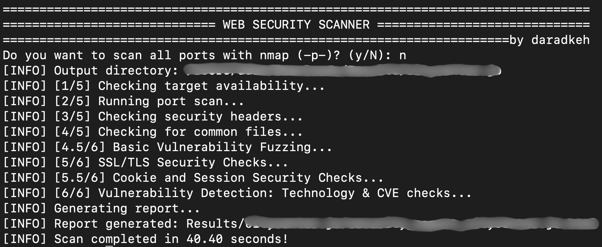

# 🛡️ Website Security Scanner


[](www.linkedin.com/in/daradkehh)

A powerful, all-in-one **Web Security Scanner** for penetration testers, bug bounty hunters, and sysadmins.  
Easily scan websites for open ports, security headers, exposed files, vulnerabilities, SSL issues, and more — all with a single Python script and beautiful HTML reports.



---

## 🧑‍💻 Languages & Technologies Used

- **Python 3** (main language)
- **Shell/Bash** (for running Nmap and system commands)
- **HTML/CSS** (for report generation)

---

## 🚀 Features

- 📁 **Organized Output:** Domain-based folders for every scan
- ⚡ **Port Scanning:** Fast Nmap integration (or fallback to sockets)
- 🕵️ **Security Header Analysis:** Checks for all critical HTTP headers
- 🏷️ **Technology & CMS Detection:** Fingerprints backend tech and CMS
- 🔍 **Common File Exposure:** Finds `.env`, `robots.txt`, `.git/config`, etc.
- 🧪 **Vulnerability Fuzzing:** XSS, SQLi, LFI fuzzing on forms & URL params
- 🔒 **SSL/TLS Checks:** Certificate, expiry, and weak cipher detection
- 🍪 **Cookie Security:** Checks Secure, HttpOnly, SameSite flags
- 🐞 **CVE Lookup:** Finds known vulnerabilities for detected tech
- 📊 **HTML Reporting:** Clean, detailed, and shareable reports

---

## 📦 Requirements

- Python 3.6+
- [nmap](https://nmap.org/) (optional, for advanced port scanning)
- Python packages: `requests`

### Install dependencies

```bash
pip install -r requirements.txt
```

**requirements.txt**
```
requests
```
> **System dependencies:**  
> - Python 3.6 or higher  
> - nmap (for advanced port scanning, optional but recommended)  
>   - Ubuntu/Debian: `sudo apt install nmap`  
>   - MacOS: `brew install nmap`  
> - OpenSSL (for SSL/TLS checks, usually pre-installed)  
> - pip (for installing Python packages)  

---

## 🛠️ Usage

```bash
python3 website_security_scanner.py --target https://example.com
```

You’ll be prompted if you want to scan all ports with nmap (`-p-`).  
Results and reports are saved in `Results/<domain>/`.

---

## 📂 Output

- **HTML Report:** `Results/<domain>/security_report_<domain>.html`
- **Port Scan Results:** `Results/<domain>/port_scan.txt`
- **Homepage HTML:** `Results/<domain>/homepage.html`

---

## ⚠️ Disclaimer & License

> **This tool is for educational and authorized security testing only.**
>
> - **Do NOT scan targets without explicit permission.**
> - **You may NOT copy, redistribute, or claim credit for this code.**
> - Commercial use, code reuse, or derivative works are strictly prohibited.
>
> _If you find this useful, please star the repo and give credit!_

---

### 📜 License

MIT License

---

## 👤 Author

**Daradkeh**  
[GitHub](https://github.com/daradkeh69) •
